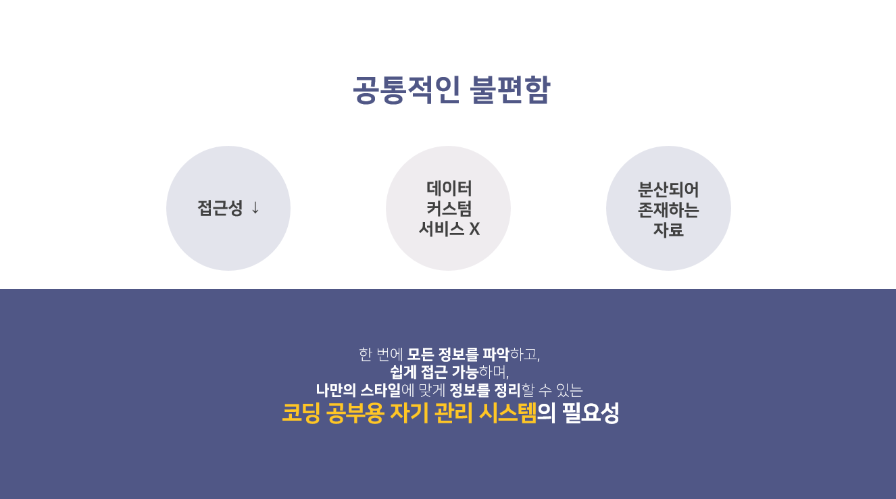
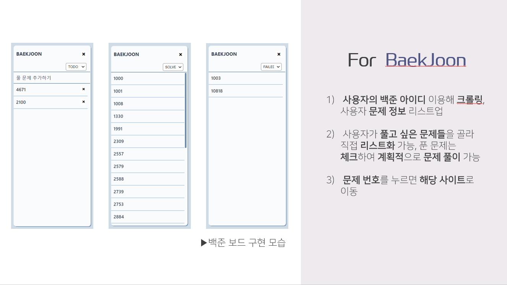
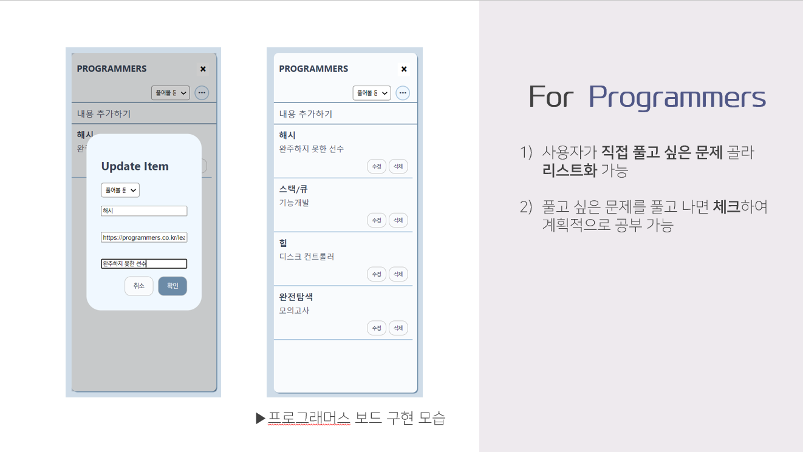
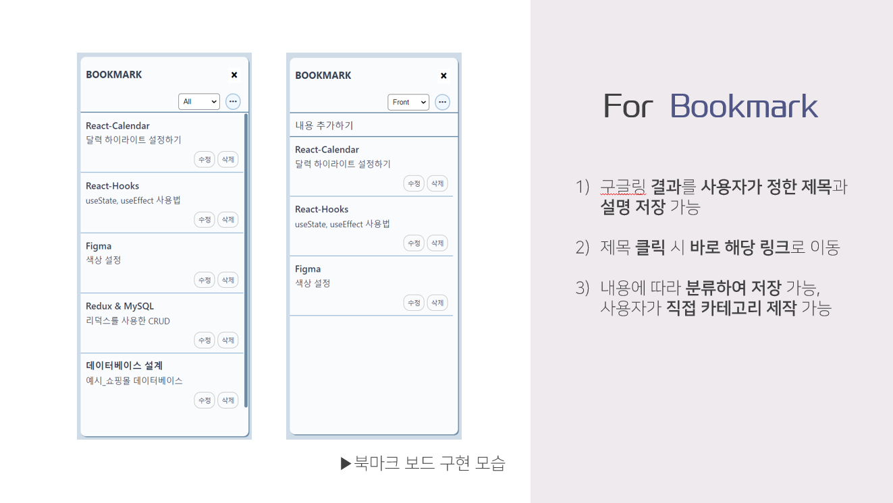
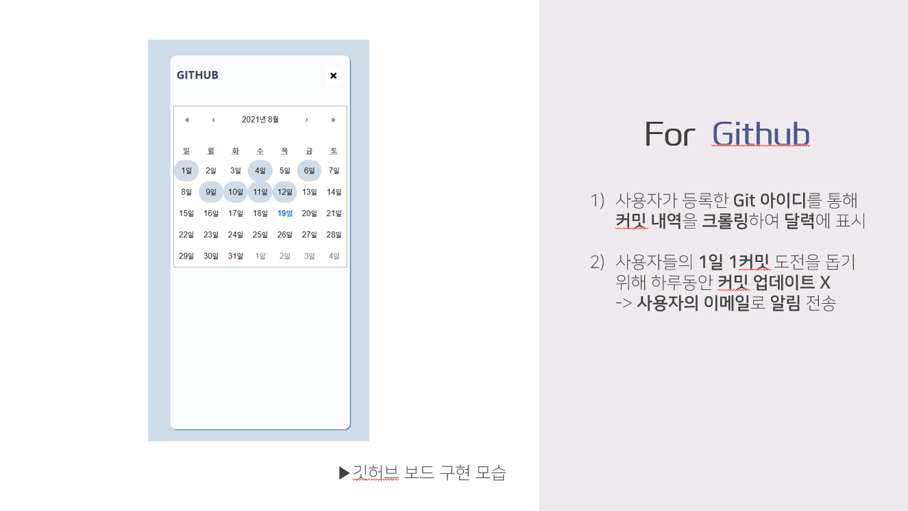

# coin_repo

### 기능
- 1일 1커밋 확인 기능 : 깃 사용법을 익히고, 또 매일 조금씩이라도 코딩을 연습하는 시간을 가질 수 있도록 습관화하는 1일 1커밋을 실천할 수 있도록 도와준다. 사용자가 특정 레포지토리를 스터디용으로 설정하고 해당 레포지토리에 커밋을 하면 이를 자동으로 확인해준다. 사용자가 기간을 설정해두고 해당 기간동안 커밋이 이루어지지 않으면 메일이나 메신저를 이용하여 알려주고, 사용자가 다시 실천할 수 있도록 유도한다. 이는 git에서 제공하는 커밋 확인 기능 api를 사용하여 구현하고자 한다.
- 알고리즘 문제 풀이 사이트에서 풀고자 하는 문제를 풀었는지 체크하는 기능:사용자가 풀고자 하는 문제 리스트를 사용자가 작성하면 해당 사이트에서 문제 정보와 링크 등을 가져와서 제공한다. (크롤링 방식 이용) 또한 풀었다면 체크를 하고, 아직 풀지 못한 문제들을 한 눈에 볼 수 있게 제공한다. 성공이나 실패 여부를 등록하여 만약 실패한다면 나중에 다시 도전할 수 있도록 목록화하여 제공한다.
- 구글링했던 사이트들을 한 눈에 볼 수 있는 스크랩 기능: 스크랩끼리 파일 분류를 하여 정리할 수 있게끔 분류 기능을 제공한다. 스크랩할 때 제목을 사용자가 스스로 정할 수 있고 어떤 내용이었는지 요약할 수 있게 메모 기능 또한 제공한다.

### 작품 개발환경
- mysql: 데이터베이스
- javascript(react js): 프론트엔드
- node js: 백엔드
- 피그마: 초기의 프로토타입 제작용 디자인 툴
- git과 github (개발툴)

